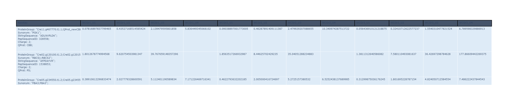
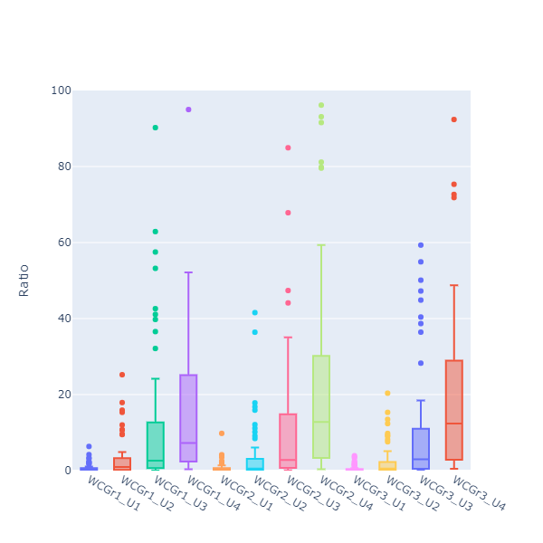
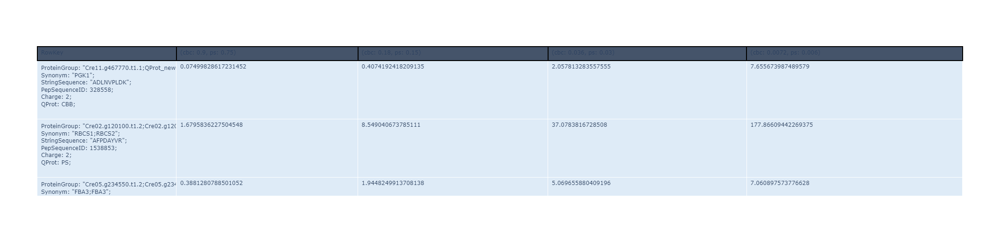
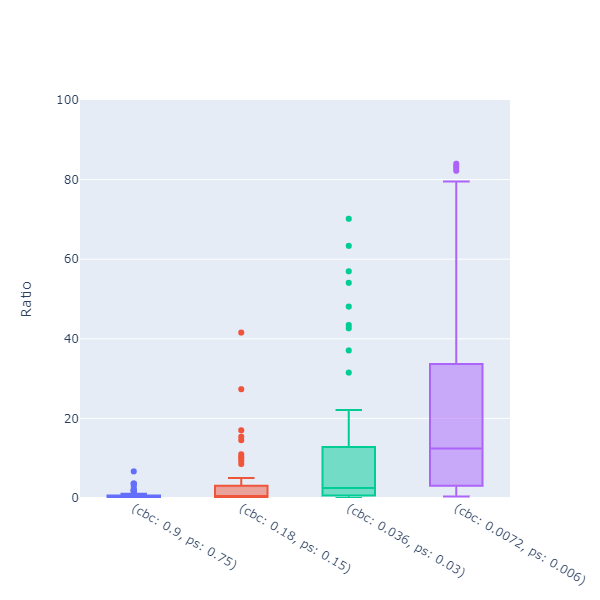
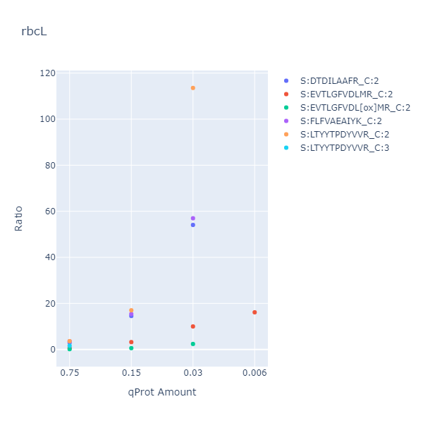

# VS Code Remote-Container and the ARC
_[Jonathan Ott](https://github.com/Joott)_, _[Kevin Frey](https://github.com/Freymaurer)_ ~ _last updated: 2022-04-25_

In this blogpost I will deal with the question how computational data analysis could look like in a reproducible environment. You can read more about FAIR data and the important concepts on the [DataPLANT website](https://www.nfdi4plants.de). DataPLANT's research data management is built around the **ARC** ([Annotated Research Context](https://www.nfdi4plants.de/content/learn-more/annotated-research-context.html)), a folder and file structure to not only annotate research data but also to store and share it. Workflows and Runs also refer to computational data analysis done on the produced data. It is important that not only laboratory experiments are reproducible, but also the data analysis is repeatable. Therefore, i propose using Visual Studio Code [`Remote-Containers`](https://code.visualstudio.com/docs/remote/containers) for scripting in an ARC environment. This VS Code extensions allows us to connect with our personal VS Code instance to a VS Code Server instance inside a docker container. Inside of the docker container runs defined development environment, which allows any user to recreate the environment under which the data analysis was originally performed.


## Requirements

- Installed [Docker](https://docs.docker.com/get-docker/).
- VS Code with [`Remote-Containers`](https://code.visualstudio.com/docs/remote/containers) extension.

## Set up

This blogpost assumes that an ARC was already created (with the [ArcCommander](https://nfdi4plants.org/content/service.html)) and the data annotated (with [Swate](https://github.com/nfdi4plants/Swate#swate)). The example ARC I will link for this blogpost was reduced to a minimal version for ease of use.

To use remote containers we need 3 things:

- a `.devcontainer` folder with the following files:
    - `.devcontainer/devcontainer.json`
    - `.devcontainer/settings.vscode.json`
- ``Dockerfile``

For this example I will use a devcontainer "designed" for an F# development environment. Let's start with a look at the devcontainer.json

```json
// devcontainer.json
{
    "name": "FSharpCodeContainer",
    "dockerFile": "../Dockerfile", // Path to Dockerfile with environment
    "appPort": [8080],
    "extensions": [ 
        "ionide.ionide-fsharp", // F# extension
        "ms-vscode.csharp",
        "editorconfig.editorconfig",
        "ms-dotnettools.dotnet-interactive-vscode", // allows to create juypter notebooks with .NET kernel
        "cweijan.vscode-office" // can display .xlsx files in VS Code
    ],
} 
```

Here we can specify, which extensions the VS Code Server instance in our docker container should be running. We also reference the dockerfile which should be used to build the container. There we specify that we for example want to use the .NET sdk 6.0.

```Dockerfile
FROM mcr.microsoft.com/dotnet/sdk:6.0
# Dockerfile

# Copy endpoint specific user settings into container to specify
# .NET Core should be used as the runtime.
COPY .devcontainer/settings.vscode.json /root/.vscode-remote/data/Machine/settings.json

# Install git, process tools
RUN apt-get update && apt-get -y install git procps

WORKDIR /workspaces/FSharpCodespace/dependencies
```

> 👀 If you want to go along the example, you can download the minimal arc (``arc-bio-bte-06-l-7-small.zip``) from the [CSBlog repository](https://github.com/CSBiology/CSBlog).

## Folderstructure

<pre>assays
    - VP21_WC
        - dataset
            - WCAnnotated_Ratio.txt
        isa.assay.xlsx
runs
    - VP21_WC
        data-analysis.ipynb
        analyze.yml
        data-analysis.fsx
workflows
    - FSharpContainer
        Dockerfile
        - .devcontainer
            - devcontainer.json
            - settings.vscode.json
    FSharpContainer.cwl</pre>

There are more folders and files in there, but let's focus on these for now.

- `assays\VP21_WC\dataset\WCAnnotated_Ratio.txt` is the file that contains the data. It is a tab separated file and contains the 14N/15N ratios ([ref](https://training.galaxyproject.org/training-material/topics/proteomics/tutorials/protein-quant-sil/tutorial.html)) for the proteins of interest.
- `assays\VP21_WC\isa.assay.xlsx` contains the metadata information for the experiment. Growthconditions, [QconCat proteins](https://pubmed.ncbi.nlm.nih.gov/26791984/), and biological replicates to name a few.
- `runs\VP21_WC\data-analysis.ipynb` is the notebook that contains the data analysis. It is a [Jupyter Notebook](https://jupyter-notebook.readthedocs.io/en/stable/) with .NET Kernel and F# code.
- `workflows\FSharpContainer\` contains the information for the VS Code remote container.

## How to start

1. Open the `workflows\FSharpContainer\` folder on root level as workspace in VS Code.
2. Click on the new bottom left `><` button and `Reopen in container`.
3. This will create the container in docker (needs to be running) and binds the workspace and all changes into the docker dev environment.
4. All changes are computed in the docker environment but reflected to the local files.

## ⚠️ .devcontainer MUST be on root level

In an *ARC* we don't want to have the .devcontainer folder in the root of the project. But instead we want to have it under *workflows*.
So to start the devcontainer with VS Code we need to open the exact parent folder of `.devcontainer` folder. In this case `arc-bio-bte-06-l-7-small/workflows/FSharpCodeContainer`.

This means most files in the mounted volume will not be displayed in the VS Code file explorer.

This issue is also mentioned [here](https://github.com/microsoft/vscode-remote-release/issues/2413).

### How to open/access not displayed files 

- <kbd>Ctrl</kbd> + <kbd>O</kbd> to use VS Code `Open File...` . 
- `File` -> `Open Folder...` to rescope workspace to base folder.

> 👀 If you downloaded the example arc open `runs\VP21_WC\data-analysis.ipynb` and follow along from there. All content will be the same, but you can run the code in the jupyter notebook.

## Dependencies

We start by importing all required nuget packages.

```Fsharp
#r "nuget: Deedle, 2.3.0"
#r "nuget: Plotly.NET, 2.0.0-preview.16"
#r "nuget: Plotly.NET.Interactive, 2.0.0-preview.16"
#r "nuget: FSharp.Stats, 0.4.1"
#r "nuget: FSharpAux"
#r "nuget: BIO-BTE-06-L-7_Aux, 0.0.9"
#r "nuget: ISADotNet, 0.4.0-preview.4"
#r "nuget: ISADotNet.XLSX, 0.4.0-preview.4"
#r "nuget: ISADotNet.IO, 0.0.2"

open Deedle
open Plotly.NET
open Plotly.NET.LayoutObjects
open FSharp.Stats
open System.IO
open FSharpAux
open BIO_BTE_06_L_7_Aux.Deedle_Aux
```

## Review Assay file

The devcontainer has the `Office Viewer` extension installed so we can open `/workspaces/blogpost-playground/arc-bio-bte-06-l-7-small/assays/VP21_WC/isa.assay.xlsx` without leaving the VS Code environment!

Some important things to note from the isa.assay.xlsx file.

- In the `Cultivation` sheet we can see that the experiment used 3 biological replicates.
- In `Protein Extraction` we can see, that the replicates were split into 4 samples each with different quantities of Q-Protein:
    - `Parameter [15N Calvin-Benson cycle QconCAT mass#3]`
    - `Parameter [15N Photosynthesis QconCAT mass#4]`
- Any further processing was done equally on all those samples.
- All data processing ends in one file `../../assays/VP21_WC/dataset/WCAnnotated_Ratio.txt`. 
    - ⚠️ Normally the computational part should be better annotated, but for this minimal example we just have to know that the result file contains 14N/15N ratios for all peptides of the two used Q-Proteins. ⚠️

## Data analysis

### Data access

We start by accessing our data and reading it into an [Deedle frame](https://fslab.org/packages.html).

```fsharp
[<Literal>]
let dataPath = @"../../assays/VP21_WC/dataset/WCAnnotated_Ratio.txt"

// quality control, check dilution series. In this example mean should always increase by times 5.
type Qprot =
    | CBB
    | PS

type PeptideIon = 
    {
        ProteinGroup    : string  
        Synonym         : string
        StringSequence  : string
        PepSequenceID   : int
        Charge          : int
        QProt           : Qprot
    }

let rowKeyColNames = [|"ProteinGroup"; "StringSequence"; "PepSequenceID"; "Charge"; "Synonym"|]

/// Open .xlsx file and index rows with column information. Then drop those columns
let readQuantAndProtFrame (path: string) =
    let frame =
        Frame.ReadCsv (path,true,separators="\t")
        |> Frame.indexRowsUsing (fun s ->
            let pGroup = 
                s.GetAs<string>("ProteinGroup")
                |> String.split ';'
                |> Array.sort
                |> String.concat ";"
            {
                ProteinGroup = pGroup
                StringSequence = s.GetAs<string>("StringSequence")
                PepSequenceID = s.GetAs<int>("PepSequenceID")
                Charge = s.GetAs<int>("Charge")
                Synonym = s.GetAs<string>("Synonym")
                QProt = 
                    match pGroup |> String.contains "QProt_newCBB", pGroup |> String.contains "QProt_newPS" with
                    | true, false  -> CBB
                    | false, true  -> PS  
                    | anythingElse -> failwith $"Error! unexpected input in cbb ps matching: {anythingElse}" 
            }
        )
    /// The following works on a mutable frame, so we can drop all columns we don't need without forwarding the frame to the next column to drop.
    rowKeyColNames 
    |> Array.map (fun name ->
        frame.DropColumn(name)
    )
    |> ignore
    frame

let data = readQuantAndProtFrame dataPath
```

#### Visualisation 1

Check the current state with:

```fsharp
data 
|> Frame.take 10
|> formatAsTable 500
```

<details>
<summary>Image of table data</summary>



</details>

#### Visualisation 2

Display the same data as boxplot:

```fsharp
let createBoxPlot f =
    f
    |> Frame.getNumericCols
    |> Series.map (fun k s ->
        let x,y =
            s
            |> Series.values
            |> Seq.map (fun values -> 
                string k, values
            )
            |> Seq.unzip
        Chart.BoxPlot(x, y, Orientation = StyleParam.Orientation.Vertical)
    )
    |> Series.values
    |> Chart.combine
    |> Chart.withYAxisStyle("Ratio", MinMax=(0, 100))
    |> Chart.withLegend(false)

createBoxPlot data
```

<details>
<summary>Image data as boxplot</summary>



</details>

<br>

This plot shows the 15N/14N ratio of all detected Q-Protein peptides.

### Metadata access

Next we want to calculate the mean for all peptides over the biological replicates.

We want to access the metadata from `assays\VP21_WC\isa.assay.xlsx`. We can traverse the annotation tables of the .xlsx file with the [ISADotNet](https://github.com/nfdi4plants/ISADotNet) library.

```fsharp
let normalizeFileName (f: string) = if Path.HasExtension f then f else Path.ChangeExtension(f, "wiff")

open ISADotNet
open arcIO.NET

let assayFilePath = @"../../assays/VP21_WC/isa.assay.xlsx"

/// Put these functions into a separate code block. Run them once and then work in a new block, 
/// to avoid getting an error when you have the .xlsx file open somewhere else
let _,_,_,myAssayFile = XLSX.AssayFile.Assay.fromFile assayFilePath

let inOutMap = ISADotNet.createInOutMap myAssayFile
```

Because we know we have the sample names in the `isa.assay.xlsx` files as column headers we can use them to access related metadata information.

```fsharp
/// Get one specific value for an output column
let getColumnParam (sheetName:string) (paramName:string) (fileName: string) =
    let fN = fileName |> normalizeFileName 
    ISADotNet.tryGetParameter // can only get Parameter [xxx]
        inOutMap 
        sheetName // Excel Sheet
        paramName // Excel column name in []
        fN // last "Sample Name" in assay file, without file extension
        myAssayFile
    |> Option.defaultValue ""
    |> String.split ' '
    |> Array.head
    |> float

/// The column parameter names in isa.assay.xlsx
let cbc_qconcat = "15N Calvin-Benson cycle QconCAT mass #3"
let ps_qconcat = "15N Photosynthesis QconCAT mass #4"

let getCBC_qconcat sampleName = getColumnParam "Protein extraction" cbc_qconcat sampleName
let getPS_qconcat sampleName = getColumnParam "Protein extraction" ps_qconcat sampleName

/// example access
getColumnParam "Protein extraction" cbc_qconcat "WCGr2_U1" // 0.9
```

### Data transformation

Map over all samples to extract Q-Protein quantities and calculate the mean over all samples with the same quantities _(the biological replicates)_.

```fsharp
let cbc_ps_data =
    data
    /// col keys as row keys
    |> Frame.transpose
    /// Adjust keys to represent dilution series.
    |> Frame.mapRowKeys (fun rk -> sprintf "cbc: %A" (getCBC_qconcat rk), sprintf "ps: %A" (getPS_qconcat rk), rk)
    /// Calculate mean for all rows with the same value in cbc and ps q-protein quantity (aka. the biological replicates)
    |> Frame.applyLevel (fun (cbc,ps,_) -> cbc, ps) Stats.mean
    /// Swap rows keys back to column keys
    |> Frame.transpose

cbc_ps_data
|> formatAsTable 500
```

<details>
<summary>Image data mean as table</summary>



</details>

<details>
<summary>Image data mean as boxplot</summary>



</details>


Last we want to show only ratios for peptides related to a specific protein.

```fsharp
let plotPeptidesOf (ratios: Frame<PeptideIon,string*string>) (prot: string) = 
    ratios
    /// filter data to only show peptides of the given protein
    |> Frame.filterRows (fun k s -> k.Synonym.Contains prot || k.ProteinGroup.Contains prot)
    |> Frame.transpose
    |> Frame.getNumericCols
    |> Series.map (fun pep (values) -> 
        let qprotAmounts,ratios,fileLabel =
            values
            |> Series.map (fun dataColumnName ratio -> 
                    let cbc, ps = dataColumnName
                    let name = 
                        if pep.QProt = CBB then cbc else ps
                        |> String.split ' '
                        |> Array.last
                    name, ratio, name
            )
            |> Series.values
            |> Seq.unzip3
        Chart.Point(qprotAmounts, ratios, MultiText = fileLabel)
        |> Chart.withTraceName (sprintf "S:%s_C:%i" pep.StringSequence pep.Charge)
        |> Chart.withXAxisStyle("qProt Amount")
        |> Chart.withYAxisStyle("Ratio")
        |> Chart.withTitle (prot)
        )
    |> Series.values
    |> Chart.combine

plotPeptidesOf cbc_ps_data "rbcL"
```



Thats it for a minimal example on how we can interopt VS Code remote containers and the ARC.

## Verdict

- Remote containers allow scripting in an ARC to be reproducible and often with a lower set of requirements (only VS Code with the extension and docker).
- Scripting is handled intuitively (personal settings from VS Code are used), any files dropped into folderstructure are mounted to the container.
- Still some minor issues:
    - .devcontainer must be at root level for the active VS Code workspace.
    - lacking some computational prowess (at least out of the box).

## Outlook

The especially attentive reader might have noticed, that we listed some files under [folderstructure](#folderstructure), which were not mentioned yet.

- `workflows\FSharpContainer.cwl`
- `runs\VP21_WC\analyze.yml`
- `runs\VP21_WC\data-analysis.fsx`

A finished **ARC** will feature a  [CWL](https://www.commonwl.org) file which is meant to automatically run the complete computational pipeline. Thus, it has a dual function as an indirect annotation of the computational process. A standard CWL file will create a docker container which will run the computational pipeline.

If we manage to create CWL, Dockerfile and VS Code devcontainer in a combined manner to reuse the docker file or even the dockercontainer we would reduce maintenance issues and further generalize the workflow.

So in the future it should be possible to run the CWL pipeline with the same settings as the VS Code remote container.