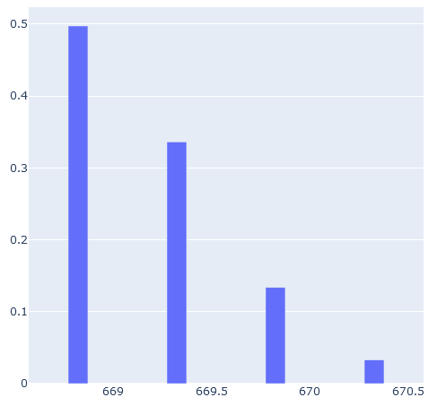
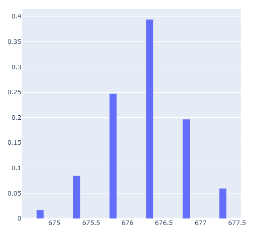
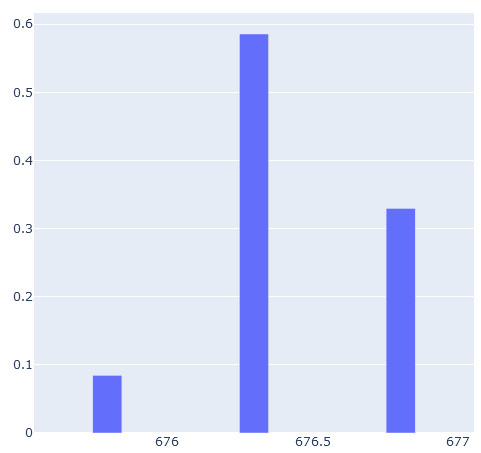
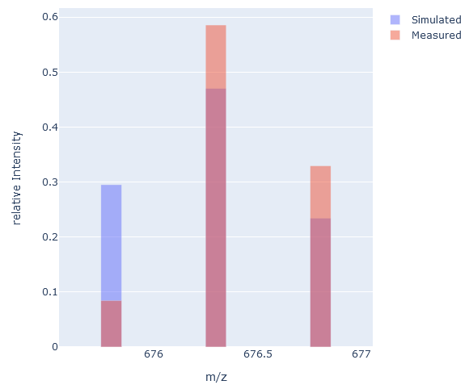

# Label Efficiency Calculator
_[Jonathan Ott](https://github.com/Joott)_ ~ _last updated: 2022-05-19_

## Isotopic Distribution
Peptide signals exhibit a characteristic shape in the mass spectrum that depend on their isotopic profile, which is defined by 
the number of naturally occurring isotopes in the peptide. The occurrence probabilities of natural isotopes are reflected in the mass 
spectrum by the relative heights of the peak series belonging to the respective peptide. The frequency at which natural isotopes occur 
is known and can be used to compute the isotope distribution of a molecule. The isotopic distribution for a given peptide molecule 
C(v)H(w)N(x)O(y)S(z) is described by the following product of polynomials:

^{v}&space;\times&space;({}^{1}\textrm{H}&plus;{}^{2}\textrm{H})^{w}&space;\times&space;({}^{14}\textrm{N}&plus;{}^{15}\textrm{N})^{x}\times({}^{16}\textrm{O}&plus;{}^{17}\textrm{O}&space;&plus;&space;{}^{18}\textrm{O})^{y}\newline\times({}^{32}\textrm{S}&plus;{}^{33}\textrm{S}&plus;{}^{34}\textrm{S}&plus;{}^{36}\textrm{S})^{z})

Symbolic expansion of the polynomials results in many product terms, which correspond to different isotopic variants of a molecule. 
Even for molecules of a medium size, the straightforward expansion of the polynomials leads to an explosion regarding the number of product terms. 
Due to this complexity, there was a need to develop algorithms for efficient computation. The different strategies comprise pruning the 
polynomials to discard terms with coefficients below a threshold (Yergey 1983) combined with a recursive 
computation (Claesen et al. 2012), and Fourier Transformation for a more efficient convolution of the isotope distributions of 
individual elements (Rockwood et al. 1995), or rely on dynamic programming (Snider 2007). 
MIDAs (Alves and Yu 2005) is one of the more elaborate algorithms to predict an isotope cluster based on a given peptide sequence.

## Simulating Isotopic Clusters for peptides
Before we start, we need to load our dependencies. The MIDAs implementation we are using here is located in BioFSharp. FSharp.Stats is required later on as well.
```Fsharp
#r "nuget: BioFSharp, 2.0.0-preview.3"
#r "nuget: FSharp.Stats, 0.4.5"
```
Our function for the generation of the isotopic distributions takes a `Formula` as an input. A `Forumla` is a type in BioFSharp which is a map of element informations and 
their number of occurences. So we start by defining a convenience function that converts an amino acid string to a `Formula` and adds water to reflect hydrolysed state in mass spectrometer.
```Fsharp
let toFormula peptide =  
    peptide
    |> BioSeq.ofAminoAcidString
    |> BioSeq.toFormula
    |> Formula.add Formula.Table.H2O
```
Next, we have our isotopic pattern simulation function. It predicts an isotopic distribution of the given formula at the given charge, normalized by the sum of probabilities, using the MIDAs algorithm.
```Fsharp
let generateIsotopicDistribution (charge:int) (f:Formula.Formula) =
    IsotopicDistribution.MIDA.ofFormula 
        IsotopicDistribution.MIDA.normalizeByProbSum
        0.01
        0.01
        charge
        f
```
We can now apply our `generateIsotopicDistribution` function to a sample peptide, in this case AAGVLDNFSEGEK
```Fsharp
let midaPattern =
    "AAGVLDNFSEGEK"
    |> toFormula
    |> generateIsotopicDistribution 2
```


The isotopic pattern we simulated so far corresponds to an unlabeled version of the peptide. In this example, we want to calculate the label efficiency for a 
15N labeled peptide. Therefore, we need a function to add 15N labeling to our `Formula` for the simulation function.
```Fsharp
let label n15LableEfficiency formula =
    let heavyN15 = Elements.Di (Elements.createDi "N15" (Isotopes.Table.N15,n15LableEfficiency) (Isotopes.Table.N14,1.-n15LableEfficiency) )
    Formula.replaceElement formula Elements.Table.N heavyN15
```
We now apply our `generateIsotopicDistribution` function to the same peptide as above, but now with a 15N label efficiency of 95%
```Fsharp
let midaPatternLE95 =
    "AAGVLDNFSEGEK"
    |> toFormula
    |> label 0.95
    |> generateIsotopicDistribution 2
```



With those functions we are now able to simulate isotopic patterns for any peptide with any charge and label efficiency. In the next step we use those functions 
to determine the label efficiency of real life data.
## Comparing simulated Isotopic Clusters with measured Isotopic Clusters

Those m/z and intensity traces were measured in a mass spectrometer for the 15N labeled peptide AAGVLDNFSEGEK we used before.
```Fsharp
let mz = [|675.7949645701999;676.2983662177933;676.8017942912567|]
let intensity = [|0.0846659638221692;0.5856855554667739;0.3296484807110569|]
```



If we now compare the measured pattern to the simulated pattern, we see some differences. The m/z values for the measured pattern are identical with 
peaks in the simulated pattern, but they are different in relative intensity and peak count.


It is difficult to extract all peaks of an isotopic pattern from a MS run. So we need to adapt our simulated pattern to better fit the measured data 
and filter the simulated pattern for peaks present in the experimentally measured pattern. Also, while both patterns are normalized in a way that their intensities 
sum to 1, they were normalized independently from each other. So we normalize our simulated pattern again after filtering to have comparable patterns.
```Fsharp
let measuredPattern = Array.zip mz intensity

let normBySum (a:seq<float*float>) =
    let s = Seq.sumBy snd a 
    Seq.map (fun (x,y) -> x,y / s) a

let simulatedPattern = 
    measuredPattern 
    |> Array.map (fun (mz,intensities) -> 
        mz,
        midaPatternLE95
        |> Seq.filter (fun (mzSim,intensitiesSim) -> abs(mzSim-mz) < 0.05 )
        |> Seq.sumBy snd
    )
    |> normBySum
```


Now our simulated pattern with an label efficiency of 95% fits the measured pattern better than before, but not quite well. So our real label efficiency is likely something 
else. To better determine the similarity of our patterns, we can use the [Kullback-Leibler divergence](https://en.wikipedia.org/wiki/Kullback%E2%80%93Leibler_divergence), 
which gives us a measure of how our simulated pattern is different from our measured pattern. We can use it in this case, since our normalized isotopic distributions are probability 
distributions.
```Fsharp
let klDiv (p:seq<float>) (q:seq<float>) = 
    Seq.fold2 (fun acc p q -> (System.Math.Log(p/q)*p) + acc ) 0. p q

klDiv (simulatedPattern|> Seq.map snd) (measuredPattern|> Seq.map snd)
```
```
val it: float = 0.1856483998
```
So the Kullback-Leibler divergence for our isotopic patterns is ~0.19. The smaller the divergence, the better the fit. So our simulated pattern can still be improved 
through the label efficiency to better fit our measured pattern.
## Determining Label Efficiency
To better work for general use cases, we can now take the functions we used above and modify them so that in the end we have a function that takes the measured isotopic pattern, 
the corresponding peptide sequence with charge and a label efficiency.
```Fsharp
let simulateFrom peptideSequence charge lableEfficiency =
    let simPattern =
        peptideSequence
        |> toFormula 
        |> label lableEfficiency
        |> generateIsotopicDistribution charge 
    simPattern

let compareIsotopicDistributions (measured:(float*float)[]) (simulated:(float*float) list)= 
    let patternSim = 
        measured
        |> Seq.map (fun (mz,intensities) -> 
            mz,
            simulated
            |> Seq.filter (fun (mzSim,intensitiesSim) -> abs(mzSim-mz) < 0.05 )
            |> Seq.sumBy snd
        )
        |> normBySum
    let klDiv = klDiv (patternSim |> Seq.map snd)  (measured |> Seq.map snd)
    klDiv

let calcKL extractedIsoPattern peptideSequence charge lableEfficiency = 
    let sim = simulateFrom peptideSequence charge lableEfficiency
    let comp = compareIsotopicDistributions extractedIsoPattern sim
    comp
```
If we now give the parameters for the measured pattern, peptide sequence and charge to this function, we have a function that takes a label efficiency and returns a measure for the 
pattern similarity. This function can then be used in a minimization function. For this we will use an algorithm called ['Brent's method'](https://en.wikipedia.org/wiki/Brent%27s_method), which is implemented in FSharp.Stats. 
Since we don't expect a label efficiency below 80% in our example, we search for the label efficiency with the best fit between 80% and 99.9%.
```Fsharp
FSharp.Stats.Optimization.Brent.minimize 
    (calcKL measuredPattern "AAGVLDNFSEGEK" 2)
    0.8
    0.999
```
```
val it: float option = Some 0.9892291257
```
According to Brent, the simulated pattern with a label efficiency of ~0.99 fits best to our measured pattern. We can now visualize both patterns and compare them.
```Fsharp
let midaPatternOptimal =
    "AAGVLDNFSEGEK"
    |> toFormula
    |> label 0.9892291257
    |> generateIsotopicDistribution 2

let simulatedPattern = 
    measuredPattern 
    |> Array.map (fun (mz,intensities) -> 
        mz,
        midaPatternOptimal
        |> Seq.filter (fun (mzSim,intensitiesSim) -> abs(mzSim-mz) < 0.05 )
        |> Seq.sumBy snd
    )
    |> normBySum
```


As we can see now, the simulated pattern is almost identical to the measured pattern. We can check the Kullback-Leibler divergence for our new pattern again and see, that 
the divergence is also better when compared to our 95% label efficiency pattern.
```Fsharp
klDiv (simulatedPattern|> Seq.map snd) (measuredPattern|> Seq.map snd)
```
```
val it: float = 0.0002724543862
```
Now, we are not limited to one peptide ion with our label efficiency calculation. We can perform this for every peptide ion in a mass spectrometry run and get a label efficiency 
coupled with a "quality measurement". This can give us a good idea for the label efficiency in a sample.

